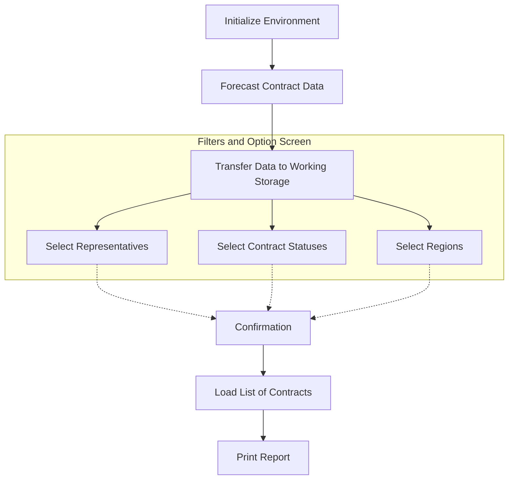

This document will cover the process of generating an active contracts report, which includes:

1. Initializing the environment
2. Forecasting contract data
3. Transferring data to working storage
4. Selecting representatives, contract statuses, and regions
5. Loading the list of contracts
6. Printing the report

# Initializing the Environment

The process begins by setting up the necessary environment for generating the report. This includes configuring the system settings and preparing the environment for data processing. The environment initialization step ensures that all system settings are correctly configured and that the environment is prepared for the subsequent data processing steps. This involves setting up the necessary conditions and ensuring that all required resources are available.

# Forecasting Contract Data

The system forecasts contract data by iterating through contract records and checking their validity. This step ensures that only valid contracts are considered for the report. In this step, the system goes through each contract record to forecast contract data. It checks the validity of each contract to ensure that only valid contracts are included in the report. This step is crucial for maintaining the accuracy and relevance of the report.

# Transferring Data to Working Storage

Contract data is transferred to working storage, and various metrics are calculated. This step prepares the data for further processing and report generation. In this step, the system transfers contract data to working storage. It also calculates various metrics that are necessary for generating the report. This step ensures that all relevant data is available and ready for the subsequent steps in the report generation process.

# Filters and options screen

The user starts on the main screen where they can set various filters and options:

- Choose a date range or month/year range for the report

- Select a specific region, representative, or state if desired

- Choose sorting options (by contract, month/year, city, etc.)

- Select which types of contracts to include (executed, to be executed, in-transit)

- Decide whether to include additional data like gifts, reportages, or sales acceptance

- Choose between filtering by sale/production date or contract forecast

&nbsp;

Importantly the user selects:

## Selecting Representatives

A popup is called to select a representative, and the selected data is moved to working storage. This step ensures that the report includes information about the representative handling the contracts. In this step, the system calls a popup to allow the user to select a representative. Once a representative is selected, the data is moved to working storage. This step ensures that the report includes information about the representative handling the contracts, which is important for tracking and accountability purposes.

## Selecting Contract Statuses

A popup is called to select a contract status, and the selected data is moved to working storage. This step ensures that the report includes the current status of each contract. In this step, the system calls a popup to allow the user to select a contract status. Once a status is selected, the data is moved to working storage. This step ensures that the report includes the current status of each contract, which is essential for understanding the contract's progress and any actions that may be required.

## Selecting Regions

A popup is called to select a region, and the selected data is moved to working storage. This step ensures that the report includes regional information for each contract. In this step, the system calls a popup to allow the user to select a region. Once a region is selected, the data is moved to working storage. This step ensures that the report includes regional information for each contract, which is important for geographical analysis and regional management.

# Confirmation

After setting the desired filters, the user would click a button to load the data (GRAVA-WORK-FLG-TRUE)

&nbsp;

# Loading the List of Contracts

The system loads the list of contracts into the report, ensuring a comprehensive view of active contracts. This step compiles all the relevant contract data into a structured format for the report. In this step, the system compiles all the relevant contract data into a structured format and loads it into the report. This ensures that the report provides a comprehensive view of all active contracts, with details such as:&nbsp;

- Contract number

- Identification

- City

- Region

- Representative

- Month/Year

- Number of graduates

- Number of photos

- Number of tapes/DVDs

- Expected sales

- Sponsorship

- Sponsorship per graduate

- Realization date

# Printing the Report

The user sets report options:

- They choose between an analytical or summary report
- They specify the number of copies to print

The system handles the printing of the report, ensuring the required number of copies are printed. This step finalizes the report generation process by producing physical copies of the report. In this final step, the system prints the report, ensuring that the required number of copies are produced.&nbsp;

&nbsp;

*This is an auto-generated document by Swimm AI 🌊 and has not yet been verified by a human*

<SwmMeta version="3.0.0" repo-id="Z2l0aHViJTNBJTNBa2VsbG8lM0ElM0Fzd2ltbWlv" repo-name="kello">Powered by [Swimm](https://app.swimm.io/)</SwmMeta>
