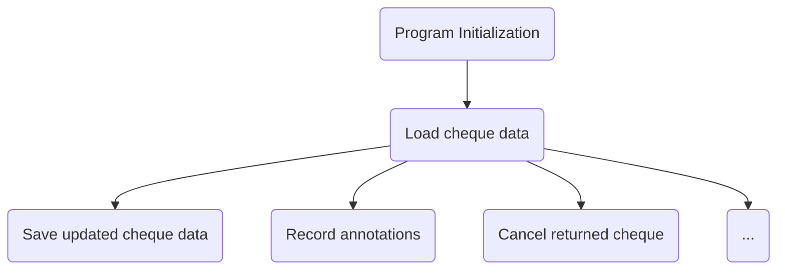
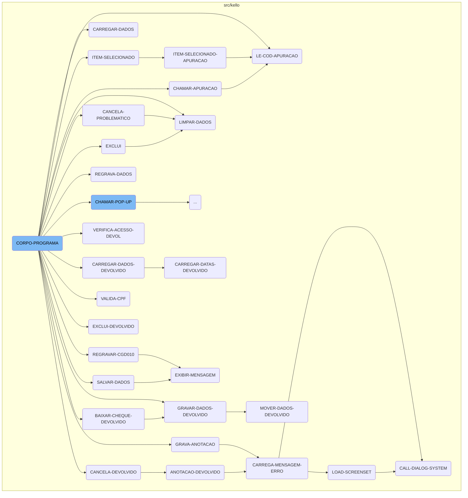
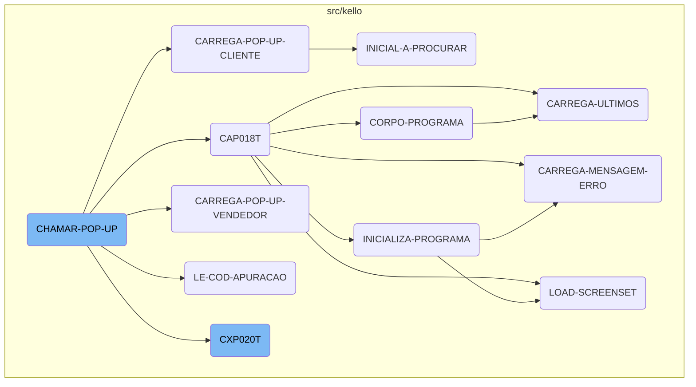
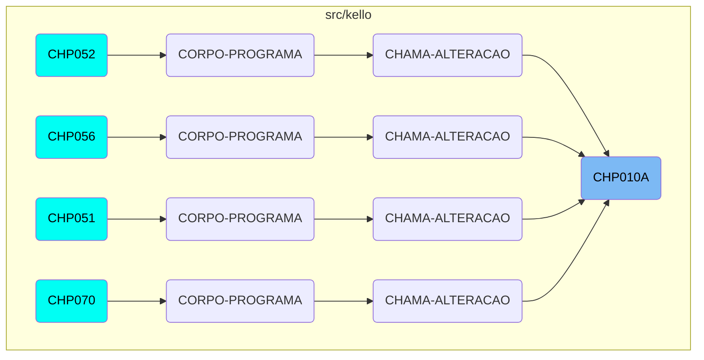

<SwmToken path="src/kello/chp010a.cbl" pos="3:6:6" line-data="       PROGRAM-ID. CHP010A.">`CHP010A`</SwmToken> is a program designed to manage cheque movements within the system. It handles various operations such as loading, saving, and validating cheque data. This program ensures that all cheque-related transactions are processed correctly and efficiently.

The flow of <SwmToken path="src/kello/chp010a.cbl" pos="3:6:6" line-data="       PROGRAM-ID. CHP010A.">`CHP010A`</SwmToken> involves several key steps. First, the program initializes by setting up necessary parameters and opening required files. It then loads cheque data into the system, ensuring that the most up-to-date information is available. The program can also save updated cheque data, record annotations, and handle the cancellation of returned cheques. Additionally, it validates user access to ensure that only authorized users can perform certain actions. Throughout the process, the program can display error messages and handle user interactions through <SwmToken path="src/kello/chp010a.cbl" pos="513:3:5" line-data="       CHAMAR-POP-UP SECTION.">`POP-UP`</SwmToken> windows.

Here is a high level diagram of the flow:



Here is a diagram of the flow, showing the flow functions:

```mermaid
graph TD;
      subgraph srckello["src/kello"]
91243c6995cd591614b7a134cd79aa6751368012e8e58179f19f85cebd92e4bd(CHP010A):::mainFlowStyle --> 055ce2e035c7dea078732c65ad67cafe8ed54c5c145e7de88db0dd2a4263c139(CHAMAR-APURACAO)
end

subgraph srckello["src/kello"]
91243c6995cd591614b7a134cd79aa6751368012e8e58179f19f85cebd92e4bd(CHP010A):::mainFlowStyle --> 66dfaba624bc427ad5b6047c3384db3bd22aed330278b64fd31a61eaf61de7a7(CAP018T)
end

subgraph srckello["src/kello"]
91243c6995cd591614b7a134cd79aa6751368012e8e58179f19f85cebd92e4bd(CHP010A):::mainFlowStyle --> dca0954cf43f3e88d3be3aed13f6f8a3932a5736c400b0d7b0b3cdf574a6be08(INICIALIZA-PROGRAMA)
end

subgraph srckello["src/kello"]
91243c6995cd591614b7a134cd79aa6751368012e8e58179f19f85cebd92e4bd(CHP010A):::mainFlowStyle --> c2e385268e6c13aa8dbf30a12fd49336a6b4879eb9a90e0cc9e46af249f3445a(CANCELA-DEVOLVIDO)
end

subgraph srckello["src/kello"]
91243c6995cd591614b7a134cd79aa6751368012e8e58179f19f85cebd92e4bd(CHP010A):::mainFlowStyle --> a60ea8d78df452854ed3572f02037a3f6ca19cd91906df6dd871d400cae0b09b(GRAVA-ANOTACAO)
end

subgraph srckello["src/kello"]
91243c6995cd591614b7a134cd79aa6751368012e8e58179f19f85cebd92e4bd(CHP010A):::mainFlowStyle --> 5df2007f8f357b1a0bda3dbaf6e052d877c89f94232f04d82d9736322beeaf9b(ANOTACAO-DEVOLVIDO)
end

subgraph srckello["src/kello"]
91243c6995cd591614b7a134cd79aa6751368012e8e58179f19f85cebd92e4bd(CHP010A):::mainFlowStyle --> 222d289c65a6206fef45a1b3d0e32761e251b3b9ad13fa4b36e2efbb0379854d(CARREGAR-DADOS)
end

subgraph srckello["src/kello"]
91243c6995cd591614b7a134cd79aa6751368012e8e58179f19f85cebd92e4bd(CHP010A):::mainFlowStyle --> 39229b8083f24c3f7c36672057172d79adb31b5ec3f9a064c1928c39da555c57(SALVAR-DADOS)
end

subgraph srckello["src/kello"]
91243c6995cd591614b7a134cd79aa6751368012e8e58179f19f85cebd92e4bd(CHP010A):::mainFlowStyle --> a914cf5f0f6b4534510872d54ae6498f32b3b2bfb2ef487138894fdc9da08e97(CARREGA-POP-UP-CLIENTE)
end

subgraph srckello["src/kello"]
91243c6995cd591614b7a134cd79aa6751368012e8e58179f19f85cebd92e4bd(CHP010A):::mainFlowStyle --> 37f04797ee6b034730a8ec3714f471a82a2fc98f6ceb42bea09e78136ce41109(CARREGA-MENSAGEM-ERRO)
end

subgraph srckello["src/kello"]
91243c6995cd591614b7a134cd79aa6751368012e8e58179f19f85cebd92e4bd(CHP010A):::mainFlowStyle --> 6f321b93a4733c97d9821eed18a3d9fa1c81e5ae4f6cc7a1275aaa74b175342b(ITEM-SELECIONADO)
end

subgraph srckello["src/kello"]
91243c6995cd591614b7a134cd79aa6751368012e8e58179f19f85cebd92e4bd(CHP010A):::mainFlowStyle --> 4ada991edabbf338ec9dede5499e8900fff9b16a66bd41b6554cfd184a30a8d9(VALIDAR-ACESSO)
end

subgraph srckello["src/kello"]
91243c6995cd591614b7a134cd79aa6751368012e8e58179f19f85cebd92e4bd(CHP010A):::mainFlowStyle --> 65145823ff831a90722e7107a947432e089d8b82c74af0062a19eb4c155662f5(CARREGA-POP-UP-VENDEDOR)
end

subgraph srckello["src/kello"]
91243c6995cd591614b7a134cd79aa6751368012e8e58179f19f85cebd92e4bd(CHP010A):::mainFlowStyle --> 291050898ea856c2f0189365af2392c931a3207778056cdf4a2424f4f7d23d67(EXCLUI)
end

subgraph srckello["src/kello"]
91243c6995cd591614b7a134cd79aa6751368012e8e58179f19f85cebd92e4bd(CHP010A):::mainFlowStyle --> d193d2e6f733f37386d3ee8240630c30ad730c7c79814691144a57c66d062bd2(BAIXAR-CHEQUE-DEVOLVIDO)
end

subgraph srckello["src/kello"]
91243c6995cd591614b7a134cd79aa6751368012e8e58179f19f85cebd92e4bd(CHP010A):::mainFlowStyle --> dfb3270fb511989e7d4ada3cd144726a5de621e13b733a487bb197df72fa5612(REGRAVAR-CGD010)
end

subgraph srckello["src/kello"]
91243c6995cd591614b7a134cd79aa6751368012e8e58179f19f85cebd92e4bd(CHP010A):::mainFlowStyle --> 911638333b6493b3a900b9d6602cc89a9c3ac9150e16f249b0ce63f103a707ec(REGRAVA-DADOS)
end

subgraph srckello["src/kello"]
91243c6995cd591614b7a134cd79aa6751368012e8e58179f19f85cebd92e4bd(CHP010A):::mainFlowStyle --> abe28ea47dc55338cab3b343dc39f4ff5c5a253f02d570553f9c78edeecfa639(GRAVAR-DADOS-DEVOLVIDO)
end

subgraph srckello["src/kello"]
91243c6995cd591614b7a134cd79aa6751368012e8e58179f19f85cebd92e4bd(CHP010A):::mainFlowStyle --> 185e54cb81c858bb1c62de5edefc6a35dfefc31ebade9cb6f7e71afb0f312826(CARREGAR-DADOS-DEVOLVIDO)
end

subgraph srckello["src/kello"]
91243c6995cd591614b7a134cd79aa6751368012e8e58179f19f85cebd92e4bd(CHP010A):::mainFlowStyle --> 75f5691cf06e93a169853e3890b889f11688e451c88c235e1e720a847c75844e(VERIFICA-ACESSO-DEVOL)
end

subgraph srckello["src/kello"]
91243c6995cd591614b7a134cd79aa6751368012e8e58179f19f85cebd92e4bd(CHP010A):::mainFlowStyle --> 074ba8e55c4bc631f3d3fc80159e7099ffb57e92f77313b935d5b38b6bc9eaa8(CANCELA-PROBLEMATICO)
end

subgraph srckello["src/kello"]
91243c6995cd591614b7a134cd79aa6751368012e8e58179f19f85cebd92e4bd(CHP010A):::mainFlowStyle --> cad5e7803d28b6cca60dfd779e5d38a1fa5a1fe490c99975f5fd080ee60877e3(LIMPAR-DADOS)
end

subgraph srckello["src/kello"]
91243c6995cd591614b7a134cd79aa6751368012e8e58179f19f85cebd92e4bd(CHP010A):::mainFlowStyle --> 7194005542ae2baa20ec39d98a9d97b10c568adb3cec0027fc96d1fe43bfee57(VALIDA-CPF)
end

subgraph srckello["src/kello"]
91243c6995cd591614b7a134cd79aa6751368012e8e58179f19f85cebd92e4bd(CHP010A):::mainFlowStyle --> 043b69b087049af0fdab3126c15a3c50e4ac6817f86c5205eb8ac4a8fdaf1df1(INICIAL-A-PROCURAR)
end

subgraph srckello["src/kello"]
91243c6995cd591614b7a134cd79aa6751368012e8e58179f19f85cebd92e4bd(CHP010A):::mainFlowStyle --> a876d072c52026157539e9f0aad79f9bfc5c404a22af862ee003c5258604e88e(ITEM-SELECIONADO-APURACAO)
end

subgraph srckello["src/kello"]
91243c6995cd591614b7a134cd79aa6751368012e8e58179f19f85cebd92e4bd(CHP010A):::mainFlowStyle --> 04ac099b9a34f4dbcc7cc1cd13e55b11f13abe708f1aeeff5966aeada35f30d4(LOAD-SCREENSET)
end

subgraph srckello["src/kello"]
91243c6995cd591614b7a134cd79aa6751368012e8e58179f19f85cebd92e4bd(CHP010A):::mainFlowStyle --> 85740ba56798b4aee3d53b5cc6ac73ebbc24493b25a4a7d0dcd6180ac069c766(EXCLUI-DEVOLVIDO)
end

subgraph srckello["src/kello"]
91243c6995cd591614b7a134cd79aa6751368012e8e58179f19f85cebd92e4bd(CHP010A):::mainFlowStyle --> fff820f0e7c10c42100a053c0e66082a3f932ebeccdff19e11e82d1b183740cf(LE-COD-APURACAO)
end

subgraph srckello["src/kello"]
91243c6995cd591614b7a134cd79aa6751368012e8e58179f19f85cebd92e4bd(CHP010A):::mainFlowStyle --> e72a90da16e126eb9c7632de75599a486ca5014e43d850718225f61449217891(EXIBIR-MENSAGEM)
end

subgraph srckello["src/kello"]
91243c6995cd591614b7a134cd79aa6751368012e8e58179f19f85cebd92e4bd(CHP010A):::mainFlowStyle --> 1bf13440258008801b2f5589d0a467d5850bce5cdb1a609594a6837451daa5c4(CARREGAR-DATAS-DEVOLVIDO)
end

subgraph srckello["src/kello"]
91243c6995cd591614b7a134cd79aa6751368012e8e58179f19f85cebd92e4bd(CHP010A):::mainFlowStyle --> 2b0af61319bb1bcd05756fcc17c794dc5aed212c130ba6000e2f68fbc43c1d52(CORPO-PROGRAMA):::mainFlowStyle
end

subgraph srckello["src/kello"]
2b0af61319bb1bcd05756fcc17c794dc5aed212c130ba6000e2f68fbc43c1d52(CORPO-PROGRAMA):::mainFlowStyle --> 055ce2e035c7dea078732c65ad67cafe8ed54c5c145e7de88db0dd2a4263c139(CHAMAR-APURACAO)
end

subgraph srckello["src/kello"]
2b0af61319bb1bcd05756fcc17c794dc5aed212c130ba6000e2f68fbc43c1d52(CORPO-PROGRAMA):::mainFlowStyle --> c2e385268e6c13aa8dbf30a12fd49336a6b4879eb9a90e0cc9e46af249f3445a(CANCELA-DEVOLVIDO)
end

subgraph srckello["src/kello"]
2b0af61319bb1bcd05756fcc17c794dc5aed212c130ba6000e2f68fbc43c1d52(CORPO-PROGRAMA):::mainFlowStyle --> a60ea8d78df452854ed3572f02037a3f6ca19cd91906df6dd871d400cae0b09b(GRAVA-ANOTACAO)
end

subgraph srckello["src/kello"]
2b0af61319bb1bcd05756fcc17c794dc5aed212c130ba6000e2f68fbc43c1d52(CORPO-PROGRAMA):::mainFlowStyle --> 222d289c65a6206fef45a1b3d0e32761e251b3b9ad13fa4b36e2efbb0379854d(CARREGAR-DADOS)
end

subgraph srckello["src/kello"]
2b0af61319bb1bcd05756fcc17c794dc5aed212c130ba6000e2f68fbc43c1d52(CORPO-PROGRAMA):::mainFlowStyle --> 39229b8083f24c3f7c36672057172d79adb31b5ec3f9a064c1928c39da555c57(SALVAR-DADOS)
end

subgraph srckello["src/kello"]
2b0af61319bb1bcd05756fcc17c794dc5aed212c130ba6000e2f68fbc43c1d52(CORPO-PROGRAMA):::mainFlowStyle --> 6f321b93a4733c97d9821eed18a3d9fa1c81e5ae4f6cc7a1275aaa74b175342b(ITEM-SELECIONADO)
end

subgraph srckello["src/kello"]
2b0af61319bb1bcd05756fcc17c794dc5aed212c130ba6000e2f68fbc43c1d52(CORPO-PROGRAMA):::mainFlowStyle --> 291050898ea856c2f0189365af2392c931a3207778056cdf4a2424f4f7d23d67(EXCLUI)
end

subgraph srckello["src/kello"]
2b0af61319bb1bcd05756fcc17c794dc5aed212c130ba6000e2f68fbc43c1d52(CORPO-PROGRAMA):::mainFlowStyle --> d193d2e6f733f37386d3ee8240630c30ad730c7c79814691144a57c66d062bd2(BAIXAR-CHEQUE-DEVOLVIDO)
end

subgraph srckello["src/kello"]
2b0af61319bb1bcd05756fcc17c794dc5aed212c130ba6000e2f68fbc43c1d52(CORPO-PROGRAMA):::mainFlowStyle --> dfb3270fb511989e7d4ada3cd144726a5de621e13b733a487bb197df72fa5612(REGRAVAR-CGD010)
end

subgraph srckello["src/kello"]
2b0af61319bb1bcd05756fcc17c794dc5aed212c130ba6000e2f68fbc43c1d52(CORPO-PROGRAMA):::mainFlowStyle --> 911638333b6493b3a900b9d6602cc89a9c3ac9150e16f249b0ce63f103a707ec(REGRAVA-DADOS)
end

subgraph srckello["src/kello"]
2b0af61319bb1bcd05756fcc17c794dc5aed212c130ba6000e2f68fbc43c1d52(CORPO-PROGRAMA):::mainFlowStyle --> abe28ea47dc55338cab3b343dc39f4ff5c5a253f02d570553f9c78edeecfa639(GRAVAR-DADOS-DEVOLVIDO)
end

subgraph srckello["src/kello"]
2b0af61319bb1bcd05756fcc17c794dc5aed212c130ba6000e2f68fbc43c1d52(CORPO-PROGRAMA):::mainFlowStyle --> 185e54cb81c858bb1c62de5edefc6a35dfefc31ebade9cb6f7e71afb0f312826(CARREGAR-DADOS-DEVOLVIDO)
end

subgraph srckello["src/kello"]
2b0af61319bb1bcd05756fcc17c794dc5aed212c130ba6000e2f68fbc43c1d52(CORPO-PROGRAMA):::mainFlowStyle --> 75f5691cf06e93a169853e3890b889f11688e451c88c235e1e720a847c75844e(VERIFICA-ACESSO-DEVOL)
end

subgraph srckello["src/kello"]
2b0af61319bb1bcd05756fcc17c794dc5aed212c130ba6000e2f68fbc43c1d52(CORPO-PROGRAMA):::mainFlowStyle --> 074ba8e55c4bc631f3d3fc80159e7099ffb57e92f77313b935d5b38b6bc9eaa8(CANCELA-PROBLEMATICO)
end

subgraph srckello["src/kello"]
2b0af61319bb1bcd05756fcc17c794dc5aed212c130ba6000e2f68fbc43c1d52(CORPO-PROGRAMA):::mainFlowStyle --> cad5e7803d28b6cca60dfd779e5d38a1fa5a1fe490c99975f5fd080ee60877e3(LIMPAR-DADOS)
end

subgraph srckello["src/kello"]
2b0af61319bb1bcd05756fcc17c794dc5aed212c130ba6000e2f68fbc43c1d52(CORPO-PROGRAMA):::mainFlowStyle --> 7194005542ae2baa20ec39d98a9d97b10c568adb3cec0027fc96d1fe43bfee57(VALIDA-CPF)
end

subgraph srckello["src/kello"]
2b0af61319bb1bcd05756fcc17c794dc5aed212c130ba6000e2f68fbc43c1d52(CORPO-PROGRAMA):::mainFlowStyle --> 85740ba56798b4aee3d53b5cc6ac73ebbc24493b25a4a7d0dcd6180ac069c766(EXCLUI-DEVOLVIDO)
end

subgraph srckello["src/kello"]
2b0af61319bb1bcd05756fcc17c794dc5aed212c130ba6000e2f68fbc43c1d52(CORPO-PROGRAMA):::mainFlowStyle --> fff820f0e7c10c42100a053c0e66082a3f932ebeccdff19e11e82d1b183740cf(LE-COD-APURACAO)
end

subgraph srckello["src/kello"]
2b0af61319bb1bcd05756fcc17c794dc5aed212c130ba6000e2f68fbc43c1d52(CORPO-PROGRAMA):::mainFlowStyle --> aa52f098ea64406607410ec93359fed55a621382be771bbc47748958e8686b6c(CHAMAR-POP-UP):::mainFlowStyle
end

subgraph srckello["src/kello"]
aa52f098ea64406607410ec93359fed55a621382be771bbc47748958e8686b6c(CHAMAR-POP-UP):::mainFlowStyle --> 66dfaba624bc427ad5b6047c3384db3bd22aed330278b64fd31a61eaf61de7a7(CAP018T)
end

subgraph srckello["src/kello"]
aa52f098ea64406607410ec93359fed55a621382be771bbc47748958e8686b6c(CHAMAR-POP-UP):::mainFlowStyle --> a914cf5f0f6b4534510872d54ae6498f32b3b2bfb2ef487138894fdc9da08e97(CARREGA-POP-UP-CLIENTE)
end

subgraph srckello["src/kello"]
aa52f098ea64406607410ec93359fed55a621382be771bbc47748958e8686b6c(CHAMAR-POP-UP):::mainFlowStyle --> 65145823ff831a90722e7107a947432e089d8b82c74af0062a19eb4c155662f5(CARREGA-POP-UP-VENDEDOR)
end

subgraph srckello["src/kello"]
aa52f098ea64406607410ec93359fed55a621382be771bbc47748958e8686b6c(CHAMAR-POP-UP):::mainFlowStyle --> fff820f0e7c10c42100a053c0e66082a3f932ebeccdff19e11e82d1b183740cf(LE-COD-APURACAO)
end

subgraph srckello["src/kello"]
aa52f098ea64406607410ec93359fed55a621382be771bbc47748958e8686b6c(CHAMAR-POP-UP):::mainFlowStyle --> 50518e3031fd1bb8e53d707aa6046d787959e6027e111759e97ca65df1080b6b(CXP020T):::mainFlowStyle
end

subgraph srckello["src/kello"]
50518e3031fd1bb8e53d707aa6046d787959e6027e111759e97ca65df1080b6b(CXP020T):::mainFlowStyle --> 57c09f3318c914e768529f80b084e49682558f41777bfb3084d65fa9031f346a(CORPO-PROGRAMA)
end

subgraph srckello["src/kello"]
50518e3031fd1bb8e53d707aa6046d787959e6027e111759e97ca65df1080b6b(CXP020T):::mainFlowStyle --> d025abb6e761b29c98c9819108e8b7d8d1ecc3ad78ded089b0beed6fc10839e5(LOCALIZA-PALAVRA)
end

subgraph srckello["src/kello"]
50518e3031fd1bb8e53d707aa6046d787959e6027e111759e97ca65df1080b6b(CXP020T):::mainFlowStyle --> 3b601e1b460094af4ef8dc432e55cec59cba88cf0d4f52ac584d74552f83c4b9(LOCALIZA-PROXIMA-PALAVRA)
end

subgraph srckello["src/kello"]
50518e3031fd1bb8e53d707aa6046d787959e6027e111759e97ca65df1080b6b(CXP020T):::mainFlowStyle --> ad6c361fdf34dbbac786154fde529c2642e0389e090e6584ba4a84ef4b7be33b(CARREGA-ULTIMOS)
end

subgraph srckello["src/kello"]
50518e3031fd1bb8e53d707aa6046d787959e6027e111759e97ca65df1080b6b(CXP020T):::mainFlowStyle --> 4711047a308553a0fb9c7d0a4d71e8875e5e34e7e04a220ca072c5ae494cc7bb(INICIALIZA-PROGRAMA)
end

subgraph srckello["src/kello"]
50518e3031fd1bb8e53d707aa6046d787959e6027e111759e97ca65df1080b6b(CXP020T):::mainFlowStyle --> f8430cdcc3f95727dff846873adc81a52fcf04705e82fa3cc56a1b6376a2fed9(PROCURAR-PALAVRA)
end

subgraph srckello["src/kello"]
50518e3031fd1bb8e53d707aa6046d787959e6027e111759e97ca65df1080b6b(CXP020T):::mainFlowStyle --> 6136f4f4372d684b5aa4b40f0f2394fffcb44bc67f5094c931b7c58a50074c4f(CARREGA-MENSAGEM-ERRO)
end

subgraph srckello["src/kello"]
50518e3031fd1bb8e53d707aa6046d787959e6027e111759e97ca65df1080b6b(CXP020T):::mainFlowStyle --> 5d6af480189008ef3b66928e59122a8ce990122271603b485ea53c136d2fcae0(LOAD-SCREENSET)
end

subgraph srckello["src/kello"]
50518e3031fd1bb8e53d707aa6046d787959e6027e111759e97ca65df1080b6b(CXP020T):::mainFlowStyle --> e72a90da16e126eb9c7632de75599a486ca5014e43d850718225f61449217891(EXIBIR-MENSAGEM)
end


      classDef mainFlowStyle color:#000000,fill:#7CB9F4
classDef rootsStyle color:#000000,fill:#00FFF4
classDef Style1 color:#000000,fill:#00FFAA
classDef Style2 color:#000000,fill:#FFFF00
classDef Style3 color:#000000,fill:#AA7CB9
```



# Flow drill down

First, we'll zoom into this section of the flow:

```mermaid
graph TD;
      subgraph srckello["src/kello"]
91243c6995cd591614b7a134cd79aa6751368012e8e58179f19f85cebd92e4bd(CHP010A):::mainFlowStyle --> 055ce2e035c7dea078732c65ad67cafe8ed54c5c145e7de88db0dd2a4263c139(CHAMAR-APURACAO)
end

subgraph srckello["src/kello"]
91243c6995cd591614b7a134cd79aa6751368012e8e58179f19f85cebd92e4bd(CHP010A):::mainFlowStyle --> 66dfaba624bc427ad5b6047c3384db3bd22aed330278b64fd31a61eaf61de7a7(CAP018T)
end

subgraph srckello["src/kello"]
91243c6995cd591614b7a134cd79aa6751368012e8e58179f19f85cebd92e4bd(CHP010A):::mainFlowStyle --> dca0954cf43f3e88d3be3aed13f6f8a3932a5736c400b0d7b0b3cdf574a6be08(INICIALIZA-PROGRAMA)
end

subgraph srckello["src/kello"]
91243c6995cd591614b7a134cd79aa6751368012e8e58179f19f85cebd92e4bd(CHP010A):::mainFlowStyle --> c2e385268e6c13aa8dbf30a12fd49336a6b4879eb9a90e0cc9e46af249f3445a(CANCELA-DEVOLVIDO)
end

subgraph srckello["src/kello"]
91243c6995cd591614b7a134cd79aa6751368012e8e58179f19f85cebd92e4bd(CHP010A):::mainFlowStyle --> a60ea8d78df452854ed3572f02037a3f6ca19cd91906df6dd871d400cae0b09b(GRAVA-ANOTACAO)
end

subgraph srckello["src/kello"]
91243c6995cd591614b7a134cd79aa6751368012e8e58179f19f85cebd92e4bd(CHP010A):::mainFlowStyle --> 5df2007f8f357b1a0bda3dbaf6e052d877c89f94232f04d82d9736322beeaf9b(ANOTACAO-DEVOLVIDO)
end

subgraph srckello["src/kello"]
91243c6995cd591614b7a134cd79aa6751368012e8e58179f19f85cebd92e4bd(CHP010A):::mainFlowStyle --> 222d289c65a6206fef45a1b3d0e32761e251b3b9ad13fa4b36e2efbb0379854d(CARREGAR-DADOS)
end

subgraph srckello["src/kello"]
91243c6995cd591614b7a134cd79aa6751368012e8e58179f19f85cebd92e4bd(CHP010A):::mainFlowStyle --> 39229b8083f24c3f7c36672057172d79adb31b5ec3f9a064c1928c39da555c57(SALVAR-DADOS)
end

subgraph srckello["src/kello"]
91243c6995cd591614b7a134cd79aa6751368012e8e58179f19f85cebd92e4bd(CHP010A):::mainFlowStyle --> a914cf5f0f6b4534510872d54ae6498f32b3b2bfb2ef487138894fdc9da08e97(CARREGA-POP-UP-CLIENTE)
end

subgraph srckello["src/kello"]
91243c6995cd591614b7a134cd79aa6751368012e8e58179f19f85cebd92e4bd(CHP010A):::mainFlowStyle --> 37f04797ee6b034730a8ec3714f471a82a2fc98f6ceb42bea09e78136ce41109(CARREGA-MENSAGEM-ERRO)
end

subgraph srckello["src/kello"]
91243c6995cd591614b7a134cd79aa6751368012e8e58179f19f85cebd92e4bd(CHP010A):::mainFlowStyle --> 6f321b93a4733c97d9821eed18a3d9fa1c81e5ae4f6cc7a1275aaa74b175342b(ITEM-SELECIONADO)
end

subgraph srckello["src/kello"]
91243c6995cd591614b7a134cd79aa6751368012e8e58179f19f85cebd92e4bd(CHP010A):::mainFlowStyle --> 4ada991edabbf338ec9dede5499e8900fff9b16a66bd41b6554cfd184a30a8d9(VALIDAR-ACESSO)
end

subgraph srckello["src/kello"]
91243c6995cd591614b7a134cd79aa6751368012e8e58179f19f85cebd92e4bd(CHP010A):::mainFlowStyle --> 65145823ff831a90722e7107a947432e089d8b82c74af0062a19eb4c155662f5(CARREGA-POP-UP-VENDEDOR)
end

subgraph srckello["src/kello"]
91243c6995cd591614b7a134cd79aa6751368012e8e58179f19f85cebd92e4bd(CHP010A):::mainFlowStyle --> 291050898ea856c2f0189365af2392c931a3207778056cdf4a2424f4f7d23d67(EXCLUI)
end

subgraph srckello["src/kello"]
91243c6995cd591614b7a134cd79aa6751368012e8e58179f19f85cebd92e4bd(CHP010A):::mainFlowStyle --> d193d2e6f733f37386d3ee8240630c30ad730c7c79814691144a57c66d062bd2(BAIXAR-CHEQUE-DEVOLVIDO)
end

subgraph srckello["src/kello"]
91243c6995cd591614b7a134cd79aa6751368012e8e58179f19f85cebd92e4bd(CHP010A):::mainFlowStyle --> dfb3270fb511989e7d4ada3cd144726a5de621e13b733a487bb197df72fa5612(REGRAVAR-CGD010)
end

subgraph srckello["src/kello"]
91243c6995cd591614b7a134cd79aa6751368012e8e58179f19f85cebd92e4bd(CHP010A):::mainFlowStyle --> 911638333b6493b3a900b9d6602cc89a9c3ac9150e16f249b0ce63f103a707ec(REGRAVA-DADOS)
end

subgraph srckello["src/kello"]
91243c6995cd591614b7a134cd79aa6751368012e8e58179f19f85cebd92e4bd(CHP010A):::mainFlowStyle --> abe28ea47dc55338cab3b343dc39f4ff5c5a253f02d570553f9c78edeecfa639(GRAVAR-DADOS-DEVOLVIDO)
end

subgraph srckello["src/kello"]
91243c6995cd591614b7a134cd79aa6751368012e8e58179f19f85cebd92e4bd(CHP010A):::mainFlowStyle --> 185e54cb81c858bb1c62de5edefc6a35dfefc31ebade9cb6f7e71afb0f312826(CARREGAR-DADOS-DEVOLVIDO)
end

subgraph srckello["src/kello"]
91243c6995cd591614b7a134cd79aa6751368012e8e58179f19f85cebd92e4bd(CHP010A):::mainFlowStyle --> 75f5691cf06e93a169853e3890b889f11688e451c88c235e1e720a847c75844e(VERIFICA-ACESSO-DEVOL)
end

subgraph srckello["src/kello"]
91243c6995cd591614b7a134cd79aa6751368012e8e58179f19f85cebd92e4bd(CHP010A):::mainFlowStyle --> 074ba8e55c4bc631f3d3fc80159e7099ffb57e92f77313b935d5b38b6bc9eaa8(CANCELA-PROBLEMATICO)
end

subgraph srckello["src/kello"]
91243c6995cd591614b7a134cd79aa6751368012e8e58179f19f85cebd92e4bd(CHP010A):::mainFlowStyle --> cad5e7803d28b6cca60dfd779e5d38a1fa5a1fe490c99975f5fd080ee60877e3(LIMPAR-DADOS)
end

subgraph srckello["src/kello"]
91243c6995cd591614b7a134cd79aa6751368012e8e58179f19f85cebd92e4bd(CHP010A):::mainFlowStyle --> 7194005542ae2baa20ec39d98a9d97b10c568adb3cec0027fc96d1fe43bfee57(VALIDA-CPF)
end

subgraph srckello["src/kello"]
91243c6995cd591614b7a134cd79aa6751368012e8e58179f19f85cebd92e4bd(CHP010A):::mainFlowStyle --> 043b69b087049af0fdab3126c15a3c50e4ac6817f86c5205eb8ac4a8fdaf1df1(INICIAL-A-PROCURAR)
end

subgraph srckello["src/kello"]
91243c6995cd591614b7a134cd79aa6751368012e8e58179f19f85cebd92e4bd(CHP010A):::mainFlowStyle --> a876d072c52026157539e9f0aad79f9bfc5c404a22af862ee003c5258604e88e(ITEM-SELECIONADO-APURACAO)
end

subgraph srckello["src/kello"]
91243c6995cd591614b7a134cd79aa6751368012e8e58179f19f85cebd92e4bd(CHP010A):::mainFlowStyle --> 04ac099b9a34f4dbcc7cc1cd13e55b11f13abe708f1aeeff5966aeada35f30d4(LOAD-SCREENSET)
end

subgraph srckello["src/kello"]
91243c6995cd591614b7a134cd79aa6751368012e8e58179f19f85cebd92e4bd(CHP010A):::mainFlowStyle --> 85740ba56798b4aee3d53b5cc6ac73ebbc24493b25a4a7d0dcd6180ac069c766(EXCLUI-DEVOLVIDO)
end

subgraph srckello["src/kello"]
91243c6995cd591614b7a134cd79aa6751368012e8e58179f19f85cebd92e4bd(CHP010A):::mainFlowStyle --> fff820f0e7c10c42100a053c0e66082a3f932ebeccdff19e11e82d1b183740cf(LE-COD-APURACAO)
end

subgraph srckello["src/kello"]
91243c6995cd591614b7a134cd79aa6751368012e8e58179f19f85cebd92e4bd(CHP010A):::mainFlowStyle --> e72a90da16e126eb9c7632de75599a486ca5014e43d850718225f61449217891(EXIBIR-MENSAGEM)
end

subgraph srckello["src/kello"]
91243c6995cd591614b7a134cd79aa6751368012e8e58179f19f85cebd92e4bd(CHP010A):::mainFlowStyle --> 1bf13440258008801b2f5589d0a467d5850bce5cdb1a609594a6837451daa5c4(CARREGAR-DATAS-DEVOLVIDO)
end

subgraph srckello["src/kello"]
91243c6995cd591614b7a134cd79aa6751368012e8e58179f19f85cebd92e4bd(CHP010A):::mainFlowStyle --> 2b0af61319bb1bcd05756fcc17c794dc5aed212c130ba6000e2f68fbc43c1d52(CORPO-PROGRAMA):::mainFlowStyle
end

subgraph srckello["src/kello"]
2b0af61319bb1bcd05756fcc17c794dc5aed212c130ba6000e2f68fbc43c1d52(CORPO-PROGRAMA):::mainFlowStyle --> rvgnm(...)
end

subgraph srckello["src/kello"]
a876d072c52026157539e9f0aad79f9bfc5c404a22af862ee003c5258604e88e(ITEM-SELECIONADO-APURACAO) --> fff820f0e7c10c42100a053c0e66082a3f932ebeccdff19e11e82d1b183740cf(LE-COD-APURACAO)
end

subgraph srckello["src/kello"]
074ba8e55c4bc631f3d3fc80159e7099ffb57e92f77313b935d5b38b6bc9eaa8(CANCELA-PROBLEMATICO) --> cad5e7803d28b6cca60dfd779e5d38a1fa5a1fe490c99975f5fd080ee60877e3(LIMPAR-DADOS)
end

subgraph srckello["src/kello"]
185e54cb81c858bb1c62de5edefc6a35dfefc31ebade9cb6f7e71afb0f312826(CARREGAR-DADOS-DEVOLVIDO) --> 1bf13440258008801b2f5589d0a467d5850bce5cdb1a609594a6837451daa5c4(CARREGAR-DATAS-DEVOLVIDO)
end

subgraph srckello["src/kello"]
abe28ea47dc55338cab3b343dc39f4ff5c5a253f02d570553f9c78edeecfa639(GRAVAR-DADOS-DEVOLVIDO) --> 69bdc4f7b1d97d2fc0bdae022fbae4de4b083919cd41d6229249596be6091c3c(MOVER-DADOS-DEVOLVIDO)
end

subgraph srckello["src/kello"]
dfb3270fb511989e7d4ada3cd144726a5de621e13b733a487bb197df72fa5612(REGRAVAR-CGD010) --> e72a90da16e126eb9c7632de75599a486ca5014e43d850718225f61449217891(EXIBIR-MENSAGEM)
end

subgraph srckello["src/kello"]
d193d2e6f733f37386d3ee8240630c30ad730c7c79814691144a57c66d062bd2(BAIXAR-CHEQUE-DEVOLVIDO) --> abe28ea47dc55338cab3b343dc39f4ff5c5a253f02d570553f9c78edeecfa639(GRAVAR-DADOS-DEVOLVIDO)
end

subgraph srckello["src/kello"]
291050898ea856c2f0189365af2392c931a3207778056cdf4a2424f4f7d23d67(EXCLUI) --> cad5e7803d28b6cca60dfd779e5d38a1fa5a1fe490c99975f5fd080ee60877e3(LIMPAR-DADOS)
end

subgraph srckello["src/kello"]
6f321b93a4733c97d9821eed18a3d9fa1c81e5ae4f6cc7a1275aaa74b175342b(ITEM-SELECIONADO) --> a876d072c52026157539e9f0aad79f9bfc5c404a22af862ee003c5258604e88e(ITEM-SELECIONADO-APURACAO)
end

subgraph srckello["src/kello"]
37f04797ee6b034730a8ec3714f471a82a2fc98f6ceb42bea09e78136ce41109(CARREGA-MENSAGEM-ERRO) --> 4a86d6468c97969684494c833b78e2f643c7da1fdd6afc8929f646e947784269(LOAD-SCREENSET)
end

subgraph srckello["src/kello"]
37f04797ee6b034730a8ec3714f471a82a2fc98f6ceb42bea09e78136ce41109(CARREGA-MENSAGEM-ERRO) --> 5d06ea3a685768f279ad12d1c2a18899b648fe11ef0503d5148c9d1cd445fa7e(CALL-DIALOG-SYSTEM)
end

subgraph srckello["src/kello"]
4a86d6468c97969684494c833b78e2f643c7da1fdd6afc8929f646e947784269(LOAD-SCREENSET) --> 5d06ea3a685768f279ad12d1c2a18899b648fe11ef0503d5148c9d1cd445fa7e(CALL-DIALOG-SYSTEM)
end

subgraph srckello["src/kello"]
a914cf5f0f6b4534510872d54ae6498f32b3b2bfb2ef487138894fdc9da08e97(CARREGA-POP-UP-CLIENTE) --> 043b69b087049af0fdab3126c15a3c50e4ac6817f86c5205eb8ac4a8fdaf1df1(INICIAL-A-PROCURAR)
end

subgraph srckello["src/kello"]
39229b8083f24c3f7c36672057172d79adb31b5ec3f9a064c1928c39da555c57(SALVAR-DADOS) --> e72a90da16e126eb9c7632de75599a486ca5014e43d850718225f61449217891(EXIBIR-MENSAGEM)
end

subgraph srckello["src/kello"]
5df2007f8f357b1a0bda3dbaf6e052d877c89f94232f04d82d9736322beeaf9b(ANOTACAO-DEVOLVIDO) --> 37f04797ee6b034730a8ec3714f471a82a2fc98f6ceb42bea09e78136ce41109(CARREGA-MENSAGEM-ERRO)
end

subgraph srckello["src/kello"]
a60ea8d78df452854ed3572f02037a3f6ca19cd91906df6dd871d400cae0b09b(GRAVA-ANOTACAO) --> 37f04797ee6b034730a8ec3714f471a82a2fc98f6ceb42bea09e78136ce41109(CARREGA-MENSAGEM-ERRO)
end

subgraph srckello["src/kello"]
c2e385268e6c13aa8dbf30a12fd49336a6b4879eb9a90e0cc9e46af249f3445a(CANCELA-DEVOLVIDO) --> 5df2007f8f357b1a0bda3dbaf6e052d877c89f94232f04d82d9736322beeaf9b(ANOTACAO-DEVOLVIDO)
end

subgraph srckello["src/kello"]
dca0954cf43f3e88d3be3aed13f6f8a3932a5736c400b0d7b0b3cdf574a6be08(INICIALIZA-PROGRAMA) --> 37f04797ee6b034730a8ec3714f471a82a2fc98f6ceb42bea09e78136ce41109(CARREGA-MENSAGEM-ERRO)
end

subgraph srckello["src/kello"]
dca0954cf43f3e88d3be3aed13f6f8a3932a5736c400b0d7b0b3cdf574a6be08(INICIALIZA-PROGRAMA) --> 04ac099b9a34f4dbcc7cc1cd13e55b11f13abe708f1aeeff5966aeada35f30d4(LOAD-SCREENSET)
end

subgraph srckello["src/kello"]
66dfaba624bc427ad5b6047c3384db3bd22aed330278b64fd31a61eaf61de7a7(CAP018T) --> f8f8d06ff5c1915e6e9a6845793499ddfb2aba26d681784ad16bd70819969663(CORPO-PROGRAMA)
end

subgraph srckello["src/kello"]
66dfaba624bc427ad5b6047c3384db3bd22aed330278b64fd31a61eaf61de7a7(CAP018T) --> a21b30684d376495f9c82125b439649132053a75c80a92541467738286176955(INICIALIZA-PROGRAMA)
end

subgraph srckello["src/kello"]
66dfaba624bc427ad5b6047c3384db3bd22aed330278b64fd31a61eaf61de7a7(CAP018T) --> 4a1a6531b4289f70446fd5552312f58b8b764d6f98e1fabcdd5464f003fe4069(CARREGA-ULTIMOS)
end

subgraph srckello["src/kello"]
66dfaba624bc427ad5b6047c3384db3bd22aed330278b64fd31a61eaf61de7a7(CAP018T) --> 73faf0158bd2cf1e3fe01cc230d6c8b01f693c22b428c32317399a84c0645775(CARREGA-MENSAGEM-ERRO)
end

subgraph srckello["src/kello"]
66dfaba624bc427ad5b6047c3384db3bd22aed330278b64fd31a61eaf61de7a7(CAP018T) --> af4d3b955b0885a988df5dae1279d046b85ab32d3f347d324c858bdc76db1509(LOAD-SCREENSET)
end

subgraph srckello["src/kello"]
a21b30684d376495f9c82125b439649132053a75c80a92541467738286176955(INICIALIZA-PROGRAMA) --> 73faf0158bd2cf1e3fe01cc230d6c8b01f693c22b428c32317399a84c0645775(CARREGA-MENSAGEM-ERRO)
end

subgraph srckello["src/kello"]
a21b30684d376495f9c82125b439649132053a75c80a92541467738286176955(INICIALIZA-PROGRAMA) --> af4d3b955b0885a988df5dae1279d046b85ab32d3f347d324c858bdc76db1509(LOAD-SCREENSET)
end

subgraph srckello["src/kello"]
f8f8d06ff5c1915e6e9a6845793499ddfb2aba26d681784ad16bd70819969663(CORPO-PROGRAMA) --> 4a1a6531b4289f70446fd5552312f58b8b764d6f98e1fabcdd5464f003fe4069(CARREGA-ULTIMOS)
end

subgraph srckello["src/kello"]
055ce2e035c7dea078732c65ad67cafe8ed54c5c145e7de88db0dd2a4263c139(CHAMAR-APURACAO) --> fff820f0e7c10c42100a053c0e66082a3f932ebeccdff19e11e82d1b183740cf(LE-COD-APURACAO)
end


      classDef mainFlowStyle color:#000000,fill:#7CB9F4
classDef rootsStyle color:#000000,fill:#00FFF4
classDef Style1 color:#000000,fill:#00FFAA
classDef Style2 color:#000000,fill:#FFFF00
classDef Style3 color:#000000,fill:#AA7CB9
```



<SwmSnippet path="/src/kello/chp010a.cbl" line="2">

---

## Managing cheque movements

<SwmToken path="src/kello/chp010a.cbl" pos="3:6:6" line-data="       PROGRAM-ID. CHP010A.">`CHP010A`</SwmToken> is responsible for managing cheque movements within the system. It handles various operations such as loading, saving, and validating cheque data. This program ensures that all cheque-related transactions are processed correctly and efficiently.

```cobol
       IDENTIFICATION DIVISION.
```

---

</SwmSnippet>

<SwmSnippet path="/src/kello/chp010a.cbl" line="509">

---

## Calling apuracao operations

<SwmToken path="src/kello/chp010a.cbl" pos="411:5:7" line-data="               WHEN GS-CHAMAR-APURACAO-TRUE">`CHAMAR-APURACAO`</SwmToken> is called to perform specific operations related to cheque apuracao. It uses parameters to call another program, processes the results, and then performs further operations based on the apuracao code.

```cobol
           CALL "CXP020T" USING PARAMETROS-W PASSAR-PARAMETROS
           CANCEL "CXP020T"
           MOVE PASSAR-STRING-1(52: 5) TO GS-COD-APURACAO
           PERFORM LE-COD-APURACAO.
       CHAMAR-POP-UP SECTION.
```

---

</SwmSnippet>

<SwmSnippet path="/src/kello/cap018t.cbl" line="2">

---

## Handling <SwmToken path="src/kello/chp010a.cbl" pos="513:3:5" line-data="       CHAMAR-POP-UP SECTION.">`POP-UP`</SwmToken> consultation

<SwmToken path="src/kello/chp010a.cbl" pos="517:8:8" line-data="             WHEN 3 CALL    &quot;CAP018T&quot; USING PARAMETROS-W">`CAP018T`</SwmToken> is a program that handles the <SwmToken path="src/kello/chp010a.cbl" pos="513:3:5" line-data="       CHAMAR-POP-UP SECTION.">`POP-UP`</SwmToken> consultation for cheque holders. It initializes the program, processes the main logic, and handles any errors that occur during the process.

```cobol
       IDENTIFICATION DIVISION.
```

---

</SwmSnippet>

<SwmSnippet path="/src/kello/chp010a.cbl" line="180">

---

## Initializing the program

<SwmToken path="src/kello/cxp020t.cbl" pos="73:3:5" line-data="           PERFORM INICIALIZA-PROGRAMA.">`INICIALIZA-PROGRAMA`</SwmToken> initializes the program by setting up necessary parameters, opening required files, and handling any errors that occur during the initialization. It ensures that the program is ready to process cheque movements.

```cobol
      *    ACCEPT PARAMETROS-W FROM COMMAND-LINE.
           MOVE STRING-1(20: 5) TO USUARIO-W.
           MOVE STRING-1(26: 3) TO COD-USUARIO-W

           ACCEPT DATA6-W FROM DATE.
           ACCEPT HORA-BRA FROM TIME.
           MOVE DATA6-W TO DATA-INV(3: 6).
           MOVE DATA6-W(1: 2) TO ANO-V.

           IF ANO-V > 80 MOVE "19" TO DATA-INV(1: 2)
           ELSE MOVE "20" TO DATA-INV(1: 2).

           CALL "GRIDAT1" USING DATA-INV.
           MOVE DATA-INV TO DATA-MOVTO-W.
           CALL "GRIDAT2"  USING DATA-INV.
           MOVE DATA-INV       TO DATA-DIA-I DATA-MOVTO-I.

           MOVE ZEROS TO PAG-W ERRO-W.
           INITIALIZE GS-DATA-BLOCK
           INITIALIZE DS-CONTROL-BLOCK
           MOVE GS-DATA-BLOCK-VERSION-NO TO DS-DATA-BLOCK-VERSION-NO.
```

---

</SwmSnippet>

<SwmSnippet path="/src/kello/chp010a.cbl" line="806">

---

## Cancelling returned cheques

<SwmToken path="src/kello/chp010a.cbl" pos="383:3:5" line-data="                    PERFORM CANCELA-DEVOLVIDO">`CANCELA-DEVOLVIDO`</SwmToken> handles the cancellation of returned cheques. It updates the cheque status and performs necessary annotations to ensure that the cancellation is properly recorded.

```cobol
           CLOSE CHD010
           OPEN I-O CHD010
           IF SITUACAO-CH10 = 5
              CONTINUE
           ELSE
              MOVE 5                    TO SITUACAO-CH10
              PERFORM ANOTACAO-DEVOLVIDO
           END-IF
           REWRITE REG-CHD010.

           CLOSE CHD010
           OPEN INPUT CHD010.
```

---

</SwmSnippet>

<SwmSnippet path="/src/kello/chp010a.cbl" line="827">

---

## Recording annotations

<SwmToken path="src/kello/chp010a.cbl" pos="370:3:5" line-data="                   PERFORM GRAVA-ANOTACAO">`GRAVA-ANOTACAO`</SwmToken> records annotations related to cheque movements. It ensures that all relevant information is captured and stored correctly, providing a detailed record of any changes or actions taken on the cheque.

```cobol
           OPEN I-O CRD200 CRD201.
           IF ST-CRD200 = "35"  CLOSE CRD200  OPEN OUTPUT CRD200
                                CLOSE CRD200  OPEN I-O CRD200.
           IF ST-CRD201 = "35"  CLOSE CRD201  OPEN OUTPUT CRD201
                                CLOSE CRD201  OPEN I-O CRD201.
           IF ST-CRD200 <> "00"
              MOVE "ERRO ABERTURA CRD200: "  TO GS-MENSAGEM-ERRO
              MOVE ST-CRD200 TO GS-MENSAGEM-ERRO(23: 02)
              PERFORM CARREGA-MENSAGEM-ERRO.
           IF ST-CRD201 <> "00"
              MOVE "ERRO ABERTURA CRD201: "  TO GS-MENSAGEM-ERRO
              MOVE ST-CRD201 TO GS-MENSAGEM-ERRO(23: 02)
              PERFORM CARREGA-MENSAGEM-ERRO.
           MOVE COD-COMPL-CH10 TO COD-COMPL-CR200
           MOVE ZEROS TO SEQ-CR200 ULT-SEQ.
           START CRD200 KEY IS NOT < CHAVE-CR200 INVALID KEY
                 MOVE "10" TO ST-CRD200.
           PERFORM UNTIL ST-CRD200 = "10"
             READ CRD200 NEXT RECORD AT END MOVE "10" TO ST-CRD200
               NOT AT END
                 IF COD-COMPL-CR200 <> COD-COMPL-CH10
```

---

</SwmSnippet>

<SwmSnippet path="/src/kello/chp010a.cbl" line="827">

---

## Annotating returned cheques

<SwmToken path="src/kello/chp010a.cbl" pos="812:3:5" line-data="              PERFORM ANOTACAO-DEVOLVIDO">`ANOTACAO-DEVOLVIDO`</SwmToken> handles annotations specifically for returned cheques. It captures detailed information about the return, including the reason and any relevant dates, ensuring that the return is properly documented.

```cobol
           OPEN I-O CRD200 CRD201.
           IF ST-CRD200 = "35"  CLOSE CRD200  OPEN OUTPUT CRD200
                                CLOSE CRD200  OPEN I-O CRD200.
           IF ST-CRD201 = "35"  CLOSE CRD201  OPEN OUTPUT CRD201
                                CLOSE CRD201  OPEN I-O CRD201.
           IF ST-CRD200 <> "00"
              MOVE "ERRO ABERTURA CRD200: "  TO GS-MENSAGEM-ERRO
              MOVE ST-CRD200 TO GS-MENSAGEM-ERRO(23: 02)
              PERFORM CARREGA-MENSAGEM-ERRO.
           IF ST-CRD201 <> "00"
              MOVE "ERRO ABERTURA CRD201: "  TO GS-MENSAGEM-ERRO
              MOVE ST-CRD201 TO GS-MENSAGEM-ERRO(23: 02)
              PERFORM CARREGA-MENSAGEM-ERRO.
           MOVE COD-COMPL-CH10 TO COD-COMPL-CR200
           MOVE ZEROS TO SEQ-CR200 ULT-SEQ.
           START CRD200 KEY IS NOT < CHAVE-CR200 INVALID KEY
                 MOVE "10" TO ST-CRD200.
           PERFORM UNTIL ST-CRD200 = "10"
             READ CRD200 NEXT RECORD AT END MOVE "10" TO ST-CRD200
               NOT AT END
                 IF COD-COMPL-CR200 <> COD-COMPL-CH10
```

---

</SwmSnippet>

<SwmSnippet path="/src/kello/chp010a.cbl" line="944">

---

## Loading cheque data

<SwmToken path="src/kello/chp010a.cbl" pos="359:5:7" line-data="      *    PERFORM CARREGAR-DADOS">`CARREGAR-DADOS`</SwmToken> loads cheque data into the system. It reads the necessary files and populates the relevant fields with the data, ensuring that the system has the most up-to-date information about the cheque.

```cobol
           MOVE STRING-1(1: 8) TO DATA-MOVTO-CH10.
           MOVE STRING-1(10: 4) TO SEQ-CH10.
           START CHD010 KEY IS = CHAVE-CH10 INVALID KEY CONTINUE.
           READ CHD010 INVALID KEY INITIALIZE REG-CHD010.
           MOVE DATA-MOVTO-CH10    TO DATA-INV.
           CALL "GRIDAT1" USING DATA-INV.
           MOVE DATA-INV           TO GS-DATA-MOVTO.
           EVALUATE CLASS-CLIENTE-CH10
             WHEN 0 MOVE "0-Contrato"       TO GS-CLASSIFICACAO
             WHEN 1 MOVE "1-Comum   "       TO GS-CLASSIFICACAO
             WHEN 9 MOVE "9-Unificado"      TO GS-CLASSIFICACAO
           END-EVALUATE
           MOVE CLASS-CLIENTE-CH10 TO CLASSIF-CG10.
           MOVE CLIENTE-CH10       TO GS-COD-CLIENTE CODIGO-CG10.
           READ CGD010 INVALID KEY MOVE "*****" TO COMPRADOR-CG10.
           MOVE COMPRADOR-CG10     TO GS-DESCR-CLIENTE.
           MOVE PORTADOR-CH10      TO GS-PORTADOR PORTADOR.
           READ CAD018 INVALID KEY MOVE "******" TO NOME-PORT.
           MOVE NOME-PORT          TO GS-DESCR-PORTADOR.
           EVALUATE CARTEIRA-CH10
             WHEN 1 MOVE "1-Simples " TO GS-CARTEIRA
```

---

</SwmSnippet>

<SwmSnippet path="/src/kello/chp010a.cbl" line="1041">

---

## Saving cheque data

<SwmToken path="src/kello/chp010a.cbl" pos="368:3:5" line-data="                   PERFORM SALVAR-DADOS">`SALVAR-DADOS`</SwmToken> saves the updated cheque data back into the system. It ensures that any changes made to the cheque information are properly recorded and stored.

```cobol
           IF GS-CLASSIFICACAO = SPACES
              MOVE "0" TO CLASS-CLIENTE-CH10
           ELSE
              MOVE GS-CLASSIFICACAO(1: 1)  TO CLASS-CLIENTE-CH10.

           MOVE GS-COD-CLIENTE    TO CLIENTE-CH10
           MOVE GS-PORTADOR       TO PORTADOR-CH10.
           IF GS-CARTEIRA = SPACES
              MOVE "0" TO CARTEIRA-CH10
           ELSE
              MOVE GS-CARTEIRA(1: 1) TO CARTEIRA-CH10.

           IF GS-SITUACAO-TIT = SPACES
              MOVE "00" TO SITUACAO-TIT-CH10
           ELSE
              MOVE GS-SITUACAO-TIT(1: 2) TO SITUACAO-TIT-CH10.

           MOVE GS-NR-CHEQUE       TO NR-CHEQUE-CH10.
           MOVE GS-OUTRO-DOCTO     TO OUTRO-DOCTO-CH10.
           MOVE GS-VENCTO-INV      TO DATA-VENCTO-CH10
           MOVE GS-NOME            TO NOME-CH10
```

---

</SwmSnippet>

<SwmSnippet path="/src/kello/chp010a.cbl" line="539">

---

## Loading client <SwmToken path="src/kello/chp010a.cbl" pos="553:8:10" line-data="                  MOVE &quot;INSERE-LISTA-POP-UP&quot; TO DS-PROCEDURE">`POP-UP`</SwmToken>

<SwmToken path="src/kello/chp010a.cbl" pos="515:7:13" line-data="             WHEN 1 PERFORM CARREGA-POP-UP-CLIENTE">`CARREGA-POP-UP-CLIENTE`</SwmToken> loads a <SwmToken path="src/kello/chp010a.cbl" pos="553:8:10" line-data="                  MOVE &quot;INSERE-LISTA-POP-UP&quot; TO DS-PROCEDURE">`POP-UP`</SwmToken> window with client information. It retrieves the relevant client data and displays it in a <SwmToken path="src/kello/chp010a.cbl" pos="553:8:10" line-data="                  MOVE &quot;INSERE-LISTA-POP-UP&quot; TO DS-PROCEDURE">`POP-UP`</SwmToken> for user interaction.

```cobol
           PERFORM INICIAL-A-PROCURAR.
           MOVE INICIAL-PROCURADA TO COMPRADOR-CG10.
           START CGD010 KEY IS NOT < COMPRADOR-CG10 INVALID KEY
                 MOVE "10" TO ST-CGD010.
           PERFORM UNTIL ST-CGD010 = "10"
              READ CGD010 NEXT RECORD AT END MOVE "10" TO ST-CGD010
                NOT AT END
               MOVE COMPRADOR-CG10(1: I) TO INICIAL-A-COMPARAR
               IF INICIAL-A-COMPARAR <> INICIAL-PROCURADA
                  MOVE "10" TO ST-CGD010
               ELSE
                  MOVE COMPRADOR-CG10  TO GS-LINDET1(1: 32)
                  MOVE CODIGO-CG10     TO GS-LINDET1(33: 08)
                  MOVE CLASSIF-CG10    TO GS-LINDET1(43: 1)
                  MOVE "INSERE-LISTA-POP-UP" TO DS-PROCEDURE
                  PERFORM CALL-DIALOG-SYSTEM
              END-READ
           END-PERFORM.
       INICIAL-A-PROCURAR SECTION.
```

---

</SwmSnippet>

<SwmSnippet path="/src/kello/cop055.cbl" line="613">

---

## Displaying error messages

<SwmToken path="src/kello/cop055.cbl" pos="613:1:5" line-data="       CARREGA-MENSAGEM-ERRO SECTION.">`CARREGA-MENSAGEM-ERRO`</SwmToken> handles the display of error messages. It ensures that any errors encountered during the process are communicated to the user through a <SwmToken path="src/kello/chp010a.cbl" pos="513:3:5" line-data="       CHAMAR-POP-UP SECTION.">`POP-UP`</SwmToken> message.

```cobol
       CARREGA-MENSAGEM-ERRO SECTION.
           PERFORM LOAD-SCREENSET
           MOVE "EXIBE-ERRO" TO DS-PROCEDURE
           PERFORM CALL-DIALOG-SYSTEM.
           MOVE 1 TO ERRO-W.
```

---

</SwmSnippet>

<SwmSnippet path="/src/kello/chp010a.cbl" line="591">

---

## Handling item selection

<SwmToken path="src/kello/chp010a.cbl" pos="592:3:5" line-data="              PERFORM ITEM-SELECIONADO-APURACAO">`ITEM-SELECIONADO`</SwmToken> handles the selection of items from a list. It processes the selected item and updates the relevant fields with the selected data.

```cobol
           IF GS-OPCAO-POP-UP = 4
              PERFORM ITEM-SELECIONADO-APURACAO
           ELSE
            IF GS-OPCAO-POP-UP = 2
                MOVE GS-LINDET1(33: 6) TO GS-VENDEDOR
                MOVE GS-LINDET1(1: 30) TO GS-DESCR-VENDEDOR
            ELSE MOVE GS-LINDET1(33: 8) TO GS-COD-CLIENTE
                 MOVE GS-LINDET1(43: 1) TO CLASSIF-W
                 EVALUATE CLASSIF-W
                    WHEN 0 MOVE "0-Contrato"       TO GS-CLASSIFICACAO
                    WHEN 1 MOVE "1-Comum"          TO GS-CLASSIFICACAO
                    WHEN 9 MOVE "9-Unificado"      TO GS-CLASSIFICACAO
                 END-EVALUATE
                 MOVE GS-LINDET1(1: 30) TO GS-DESCR-CLIENTE.
```

---

</SwmSnippet>

<SwmSnippet path="/src/kello/chp010a.cbl" line="318">

---

## Validating user access

<SwmToken path="src/kello/chp010a.cbl" pos="175:3:5" line-data="           PERFORM VALIDAR-ACESSO.">`VALIDAR-ACESSO`</SwmToken> validates user access to the system. It checks the user's credentials and determines the level of access they have, ensuring that only authorized users can perform certain actions.

```cobol
      *    VALIDA ACESSO - SE TEM ACESSO CHP010-MOVTO CHEQUES SEM BLOQ.
      *    SE TEM ACESSO A SENHA01-MANUTENCAO DEVOLVIDO, ENTAO SOMENTE
      *    AO BOTAO DEVOLVIDO, SENAO TODOS OS BOTOES DESABILITADO
           MOVE COD-USUARIO-W TO COD-USUARIO-CA004.
           MOVE "CHP010"      TO PROGRAMA-CA004.
           READ CAD004 INVALID KEY
                MOVE COD-USUARIO-W   TO COD-USUARIO-CA004
                MOVE "SENHA01"       TO PROGRAMA-CA004
                READ CAD004 INVALID KEY
                     MOVE COD-USUARIO-W   TO COD-USUARIO-CA004
                     MOVE "SENHA12"       TO PROGRAMA-CA004
                     READ CAD004 INVALID KEY
      *                   NEGADO
                          MOVE 3  TO GS-TIPO-ACESSO
                     NOT INVALID KEY
      *                   DEVOLVIDO
                          MOVE 2  TO GS-TIPO-ACESSO
                     END-READ
                   NOT INVALID KEY
      *              DEVOLVIDO
                     MOVE 2  TO GS-TIPO-ACESSO
```

---

</SwmSnippet>

Now, lets zoom into this section of the flow:



<SwmSnippet path="/src/kello/chp010a.cbl" line="364">

---

The <SwmToken path="src/kello/cxp020t.cbl" pos="74:3:5" line-data="           PERFORM CORPO-PROGRAMA UNTIL CXP020T-EXIT-FLG-TRUE.">`CORPO-PROGRAMA`</SwmToken> function handles various cheque operations based on different flags. For instance, when the <SwmToken path="src/kello/chp010a.cbl" pos="367:3:9" line-data="               WHEN GS-SAVE-FLG-TRUE">`GS-SAVE-FLG-TRUE`</SwmToken> flag is set, it performs a series of operations to save cheque data, including calling <SwmToken path="src/kello/chp010a.cbl" pos="368:3:5" line-data="                   PERFORM SALVAR-DADOS">`SALVAR-DADOS`</SwmToken>, <SwmToken path="src/kello/chp010a.cbl" pos="369:3:5" line-data="                   PERFORM REGRAVA-DADOS">`REGRAVA-DADOS`</SwmToken>, <SwmToken path="src/kello/chp010a.cbl" pos="370:3:5" line-data="                   PERFORM GRAVA-ANOTACAO">`GRAVA-ANOTACAO`</SwmToken>, and <SwmToken path="src/kello/chp010a.cbl" pos="371:3:5" line-data="                   PERFORM LIMPAR-DADOS">`LIMPAR-DADOS`</SwmToken>. This ensures that the cheque data is saved correctly and any annotations are recorded. Similarly, when the <SwmToken path="src/kello/chp010a.cbl" pos="374:3:9" line-data="               WHEN GS-EXCLUI-FLG-TRUE">`GS-EXCLUI-FLG-TRUE`</SwmToken> flag is set, it moves the user information to <SwmToken path="src/kello/chp010a.cbl" pos="375:9:11" line-data="                   MOVE USUARIO-W TO DIGITADOR-CH10">`DIGITADOR-CH10`</SwmToken>, sets the cheque status to 3, and performs the <SwmToken path="src/kello/chp010a.cbl" pos="374:5:5" line-data="               WHEN GS-EXCLUI-FLG-TRUE">`EXCLUI`</SwmToken> operation to exclude the cheque. Each flag corresponds to a specific operation, such as validating access (<SwmToken path="src/kello/chp010a.cbl" pos="386:3:9" line-data="               WHEN GS-VERIFICA-SENHA-TRUE">`GS-VERIFICA-SENHA-TRUE`</SwmToken>), loading data (<SwmToken path="src/kello/chp010a.cbl" pos="399:3:9" line-data="               WHEN GS-CARREGAR-DADOS-TRUE">`GS-CARREGAR-DADOS-TRUE`</SwmToken>), or calling a <SwmToken path="src/kello/chp010a.cbl" pos="513:3:5" line-data="       CHAMAR-POP-UP SECTION.">`POP-UP`</SwmToken> (<SwmToken path="src/kello/chp010a.cbl" pos="415:3:11" line-data="               WHEN GS-CHAMAR-POP-UP-TRUE">`GS-CHAMAR-POP-UP-TRUE`</SwmToken>). These operations ensure that the system can handle various scenarios related to cheque management, providing a comprehensive solution for managing cheques within the business operations.

```cobol
           EVALUATE TRUE
               WHEN GS-CENTRALIZA-TRUE
                   PERFORM CENTRALIZAR
               WHEN GS-SAVE-FLG-TRUE
                   PERFORM SALVAR-DADOS
                   PERFORM REGRAVA-DADOS
                   PERFORM GRAVA-ANOTACAO
                   PERFORM LIMPAR-DADOS
                   MOVE "SET-POSICAO-CURSOR1" TO DS-PROCEDURE
                   MOVE "SET-POSICAO-CURSOR1" TO DS-PROCEDURE
               WHEN GS-EXCLUI-FLG-TRUE
                   MOVE USUARIO-W TO DIGITADOR-CH10
                   MOVE 3 TO SITUACAO-CH10
                   PERFORM EXCLUI
                   PERFORM LIMPAR-DADOS
               WHEN GS-DEVOLVIDO-FLG-TRUE
                    MOVE USUARIO-W TO DIGITADOR-CH10

                    PERFORM GRAVAR-DADOS-DEVOLVIDO
                    PERFORM CANCELA-DEVOLVIDO
               WHEN GS-EXCLUI-DEVOLVIDO-TRUE
```

---

</SwmSnippet>

Now, lets zoom into this section of the flow:



<SwmSnippet path="/src/kello/chp010a.cbl" line="514">

---

## Handling different <SwmToken path="src/kello/chp010a.cbl" pos="514:7:9" line-data="           EVALUATE GS-OPCAO-POP-UP">`POP-UP`</SwmToken> options

The <SwmToken path="src/kello/chp010a.cbl" pos="513:1:5" line-data="       CHAMAR-POP-UP SECTION.">`CHAMAR-POP-UP`</SwmToken> function evaluates the <SwmToken path="src/kello/chp010a.cbl" pos="514:3:9" line-data="           EVALUATE GS-OPCAO-POP-UP">`GS-OPCAO-POP-UP`</SwmToken> variable to determine which <SwmToken path="src/kello/chp010a.cbl" pos="514:7:9" line-data="           EVALUATE GS-OPCAO-POP-UP">`POP-UP`</SwmToken> window to display. Depending on the value, it performs different actions such as loading client or vendor pop-ups, calling specific programs like <SwmToken path="src/kello/chp010a.cbl" pos="517:8:8" line-data="             WHEN 3 CALL    &quot;CAP018T&quot; USING PARAMETROS-W">`CAP018T`</SwmToken> or <SwmToken path="src/kello/chp010a.cbl" pos="522:8:8" line-data="             WHEN 4 CALL   &quot;CXP020T&quot; USING PARAMETROS-W PASSAR-STRING-1">`CXP020T`</SwmToken>, and handling the returned parameters. This step is crucial for directing users to the appropriate <SwmToken path="src/kello/chp010a.cbl" pos="514:7:9" line-data="           EVALUATE GS-OPCAO-POP-UP">`POP-UP`</SwmToken> based on their selection, ensuring they interact with the correct part of the system.

```cobol
           EVALUATE GS-OPCAO-POP-UP
             WHEN 1 PERFORM CARREGA-POP-UP-CLIENTE
             WHEN 2 PERFORM CARREGA-POP-UP-VENDEDOR
             WHEN 3 CALL    "CAP018T" USING PARAMETROS-W
                                            PASSAR-PARAMETROS
                    CANCEL "CAP018T"
                    MOVE PASSAR-STRING-1(1: 30) TO GS-DESCR-PORTADOR
                    MOVE PASSAR-STRING-1(33: 4) TO GS-PORTADOR
             WHEN 4 CALL   "CXP020T" USING PARAMETROS-W PASSAR-STRING-1
                    CANCEL "CXP020T"
                    MOVE PASSAR-STRING-1(52: 5) TO GS-COD-APURACAO
                    PERFORM LE-COD-APURACAO
                    MOVE DESCRICAO-CX20 TO GS-DESCR-APURACAO
             WHEN 5 CALL   "CRP001T" USING PARAMETROS-W
                                           PASSAR-PARAMETROS
                    CANCEL "CRP001T"
                    MOVE PASSAR-STRING-1(1: 30) TO GS-DESCR-SITUACAO-TIT
                    MOVE PASSAR-STRING-1(33: 2) TO GS-SITUACAO-TIT
             WHEN 6 CALL   "CHP012T" USING PARAMETROS-W
                                           PASSAR-PARAMETROS
                    CANCEL "CHP012T"
```

---

</SwmSnippet>

<SwmSnippet path="/src/kello/cxp020t.cbl" line="72">

---

## Displaying account result <SwmToken path="src/kello/chp010a.cbl" pos="513:3:5" line-data="       CHAMAR-POP-UP SECTION.">`POP-UP`</SwmToken>

The <SwmToken path="src/kello/cxp020t.cbl" pos="74:9:9" line-data="           PERFORM CORPO-PROGRAMA UNTIL CXP020T-EXIT-FLG-TRUE.">`CXP020T`</SwmToken> function is responsible for displaying the <SwmToken path="src/kello/chp010a.cbl" pos="513:3:5" line-data="       CHAMAR-POP-UP SECTION.">`POP-UP`</SwmToken> for account result inquiries. It initializes the program, processes the main logic until the exit flag is set, and then finalizes the program. This ensures that users can view and interact with account result data in a structured manner.

```cobol
       MAIN-PROCESS SECTION.
           PERFORM INICIALIZA-PROGRAMA.
           PERFORM CORPO-PROGRAMA UNTIL CXP020T-EXIT-FLG-TRUE.
```

---

</SwmSnippet>

# Where is this flow used?

This flow is used multiple times in the codebase as represented in the following diagram:

(Note - these are only some of the entry points of this flow)



&nbsp;

*This is an auto-generated document by Swimm AI 🌊 and has not yet been verified by a human*

<SwmMeta version="3.0.0" repo-id="Z2l0aHViJTNBJTNBa2VsbG8tcGxheWdyb3VuZCUzQSUzQXN3aW1taW8=" repo-name="kello"><sup>Powered by [Swimm](https://app.swimm.io/)</sup></SwmMeta>
